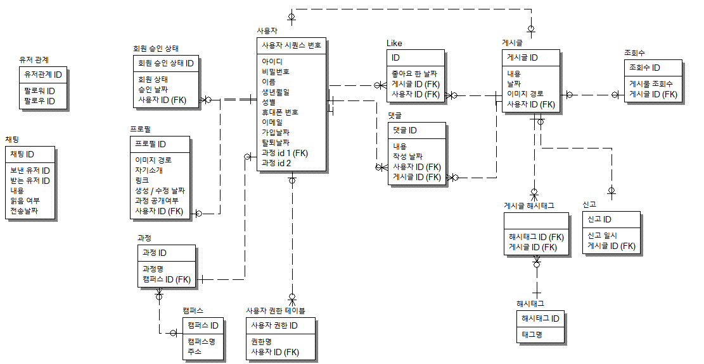

    <h1>SeSAC 커뮤니티 새싹톡</h1>

    

## 프로젝트 소개
청년취업사관학교 수강생 및 수료생들을 위한 커뮤니티인 새싹톡 서비스입니다!

 

## 주요 기능
- 인증을 통해 청년취업사관학교 수강생만 가입할 할 수 있어요. 🤫
- 원하는 사용자끼리 팔로우를 할 수 있어요. 🤝
- 게시글을 작성하여 팔로우가 되어있는 사용자끼리 공유할 수 있어요. 🚀
- 사용자들간 채팅이 가능해요. 💬
- 신규 게시글, 댓글, 채팅을 푸시알림을 통해 알림을 받을 수 있어요. 🔔
- 프로필을 커스터마이징 할 수 있어요. 🎨

 

FE 의 개인 사정으로 화면이 아직 구현되지 않는 기능이 있습니다.

API 기능은 [API 문서](https://sesactalk.notion.site/API-0ab413774d2349a9b9d70a790188dbea?pvs=4)로 확인 부탁드립니다. 🙇‍♂️

> 채용공고 API를 제외하고는 모든 기능이 구현이 되어 있습니다

 

## 기술 스택
### Frontend
- React
- Redux Toolkit
- axios 
- React-Query 
- react-router-dom 
- Tailwind.css
- Firebase Cloud Message

### Backend
- Django
- Django-environ
- rest_framework
- cors-headers
- Debug toolbar
- channels

### Database
- MySQL

 

## ERD 다이어그램

    

 

## 새싹톡 개발과정 구경하기
- [✨ 새싹톡 기획서 보러가기](https://sesactalk.notion.site/2706f043e8d14896932a3e3d40912869?pvs=4)
- [📘 활동 기록 보러가기](https://velog.io/@bibigo0717)
- [📑 API 문서 보러가기](https://sesactalk.notion.site/API-0ab413774d2349a9b9d70a790188dbea?pvs=4)
- [🏃 간트차트 구경하기](https://docs.google.com/spreadsheets/d/1zgyVY4MJRgc6aYzWQiuq4JQwyD6mEJgxNEjakOx5WkI/edit?hl=ko#gid=913347219)
